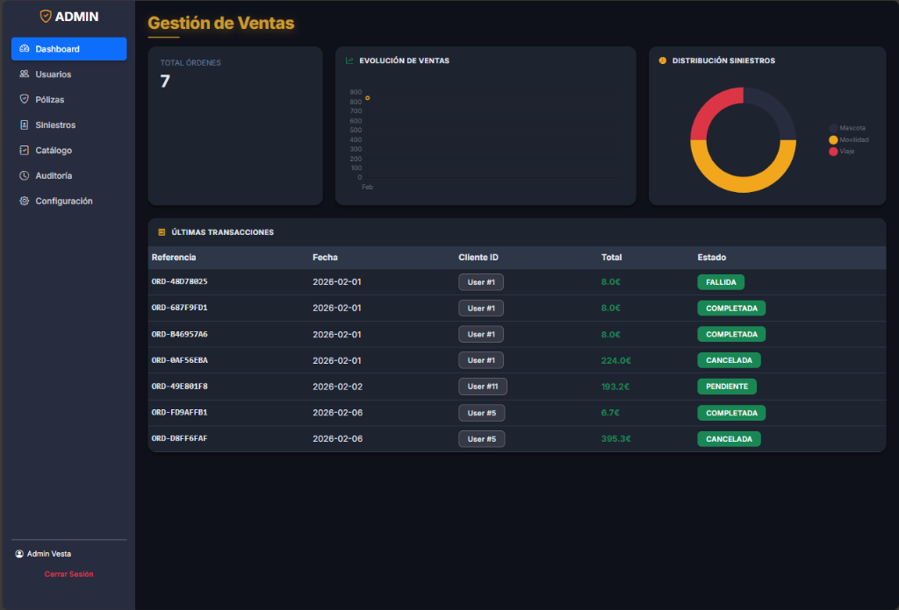
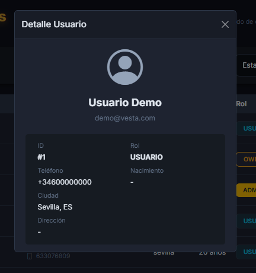
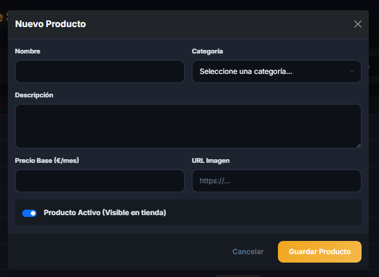
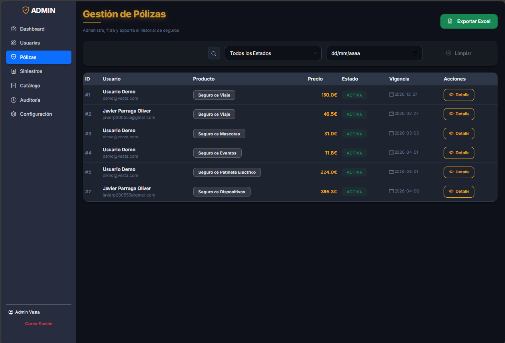
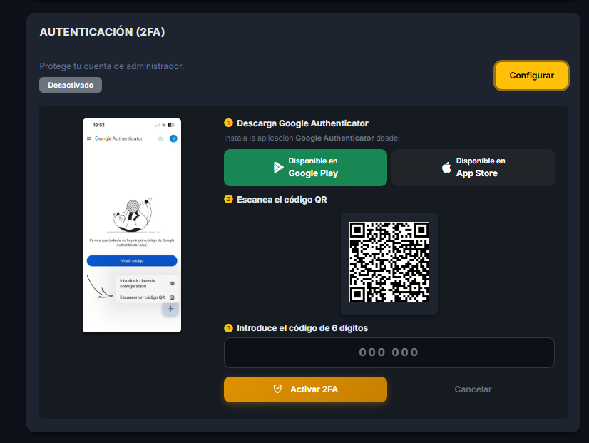

    <h1 style="border:none; font-size: 4.5em; letter-spacing: 2px;">VESTA SEGUROS</h1>
    <h3 style="color: #666; font-weight: 300; font-size: 1.5em;">Gestión Operativa y Control de Negocio</h3>
       
    <h2 style="border:none; padding:0; font-size: 2em;">Manual del Administrador</h2>
    
Guía técnica para la supervisión de siniestros, catálogo y usuarios

      
    
Versión 1.2 - Febrero 2026

## Contenidos de Soporte
1. [El Rol del Administrador](#1-el-rol-del-administrador)
2. [Dashboard de Operaciones y Ventas](#2-dashboard-de-operaciones-y-ventas)
3. [Gestión de Usuarios y Clientes](#3-gestión-de-usuarios-y-clientes)
4. [Gestión de Siniestros IA y Peritaje Digital](#4-gestión-de-siniestros-ia-y-peritaje-digital)
5. [Administración del Catálogo de Productos](#5-administración-del-catálogo-de-productos)
6. [Seguridad Operativa y Auditoría](#6-seguridad-operativa-y-auditoría)

## 1. El Rol del Administrador
El administrador de **Vesta Seguros** es la pieza clave para la estabilidad operativa de la plataforma. Su función principal es la supervisión del flujo de negocio, garantizando que tanto la contratación de pólizas como el procesamiento de siniestros se realicen de forma fluida y conforme a las reglas del sistema.

Este manual detalla las herramientas de soporte, supervisión y gestión de incidencias que el administrador tiene a su disposición para mantener la excelencia en el servicio.

  <strong>IMPORTANTE:</strong> El perfil de Administrador no dispone de permisos para la modificación de roles de usuario, tarea reservada exclusivamente para el perfil de Propietario (Owner).

## 2. Dashboard de Operaciones y Ventas
El panel de control principal ofrece una visión analítica del rendimiento de Vesta. Mediante widgets dinámicos, el administrador puede monitorizar en tiempo real el volumen de ventas, la distribución por tipo de seguro y el estado general de la plataforma.

Esta pantalla permite detectar picos de demanda o anomalías en la contratación, facilitando la toma de decisiones basada en datos.

## 3. Gestión de Usuarios y Clientes
En el apartado de **Usuarios**, el administrador tiene acceso a la ficha completa de cada cliente registrado. Puede consultar el historial de pólizas, estados de cuenta y datos de contacto para realizar labores de soporte técnico o atención al cliente.

La interfaz permite filtrar por nombre, email o rol, facilitando la localización rápida de expedientes en entornos de alto volumen de datos.

## 4. Gestión de Siniestros IA y Peritaje Digital
Esta es la sección más crítica del panel administrativo. Vesta utiliza un motor de **IA de Peritaje Digital** para pre-evaluar cada reclamación.

### El Motor de Riesgos (Fraud Score)
Cada siniestro reportado por un usuario llega al administrador con un **Scoring de Riesgo** generado automáticamente. Este score evalúa la antigüedad del usuario, imágenes de daños y metadatos para alertar sobre posibles fraudes.
- **Riesgo Bajo (Verde)**: Sugerencia de aprobación automática.
- **Riesgo Crítico (Rojo)**: Alerta de investigación manual obligatoria.

El administrador debe revisar el análisis de la IA y emitir el veredicto definitivo (Aprobar o Rechazar), el cual se comunica al usuario de forma instantánea.

## 5. Administración del Catálogo de Productos
Vesta es una plataforma viva. Desde el catálogo, el administrador puede gestionar la oferta de seguros en el marketplace.
- **Actualización de Precios**: El administrador puede ajustar las primas base según la estrategia de negocio.
- **Visibilidad**: Activar o desactivar productos (ej: seguros estacionales de eventos) de forma inmediata para todos los usuarios.
- **Gestión de Pólizas**: Supervisión global de todos los contratos vigentes, con capacidad para exportar reportes detallados en formato **Excel**.

## 6. Seguridad Operativa y Auditoría
Como gestor de datos sensibles, el administrador tiene la responsabilidad de mantener la **Auditoría de Seguridad**. El panel registra cada evento crítico (Logins, modificaciones de pólizas, exportaciones de datos), permitiendo una trazabilidad total ante cualquier auditoría externa o interna.

Es obligatorio el uso de **Doble Factor de Autenticación (2FA)** para acceder a estas funciones avanzadas, garantizando que el panel de control esté blindado ante intentos de acceso no autorizado.

