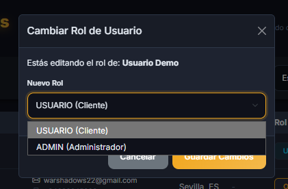
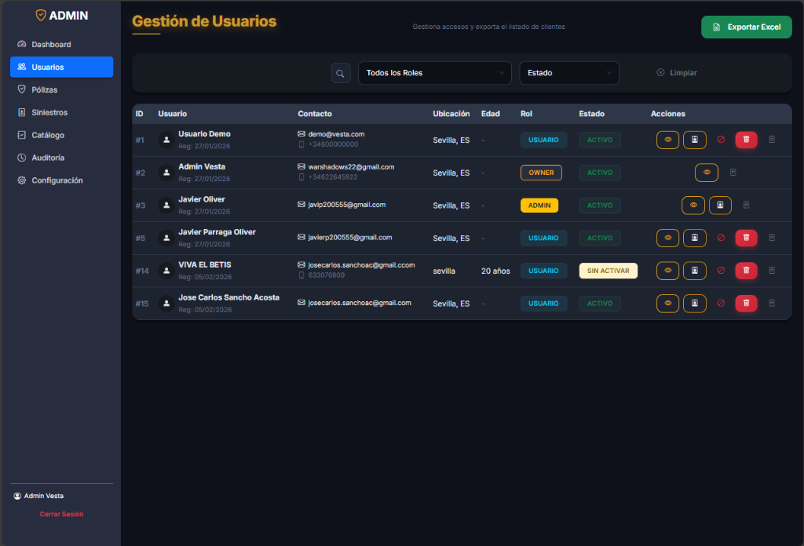
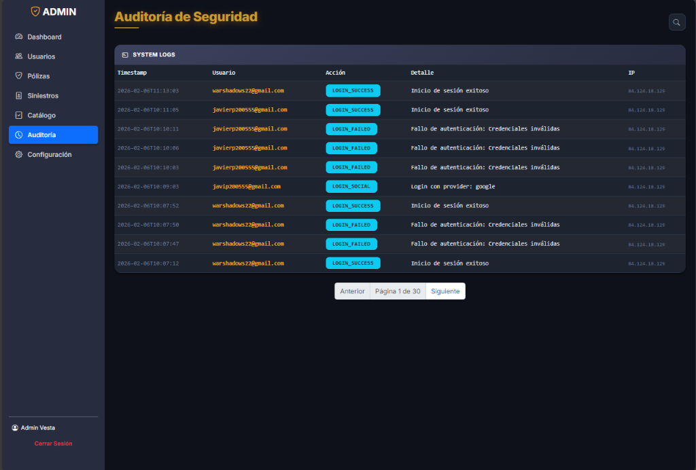
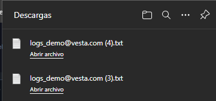
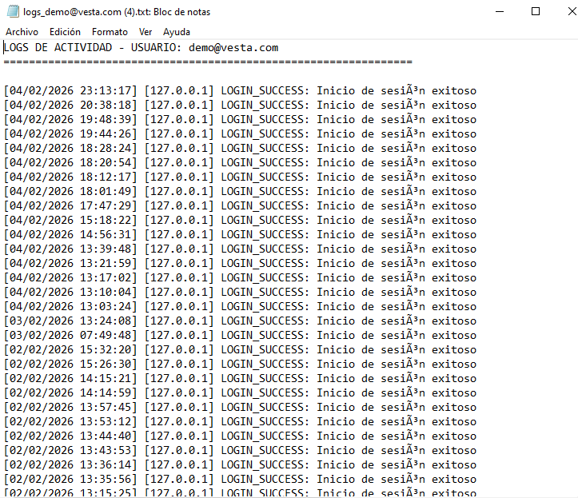
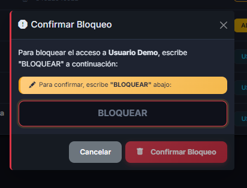
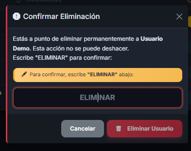
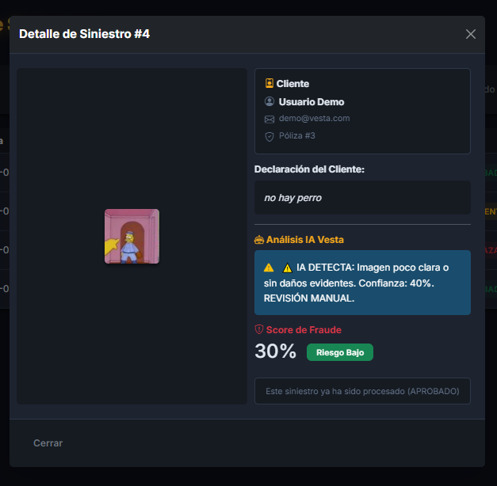
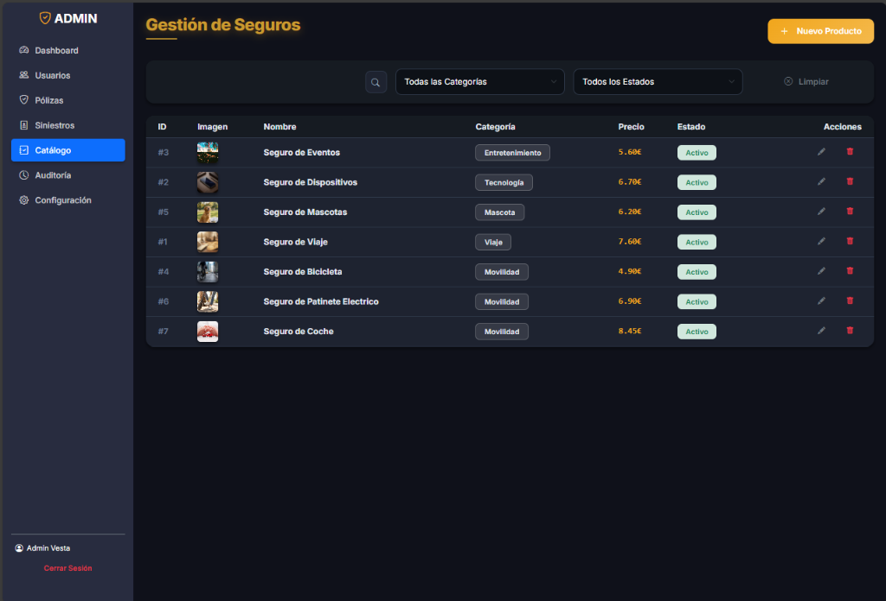
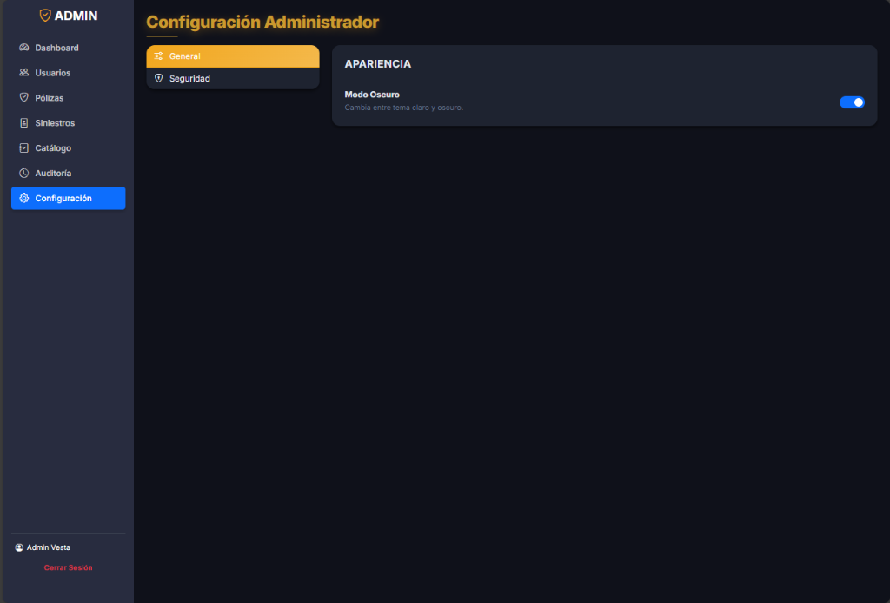

    <h1 style="border:none; font-size: 4.5em; letter-spacing: 2px;">VESTA SEGUROS</h1>
    <h3 style="color: #666; font-weight: 300; font-size: 1.5em;">Fiscalización, Seguridad y Estrategia</h3>
       
    <h2 style="border:none; padding:0; font-size: 2em;">Manual del Propietario (Owner)</h2>
    
Autoridad máxima del sistema: Auditoría crítica y control de privilegios

      
    
Versión 1.2 - Febrero 2026

## Contenidos de Alta Autoridad
1. [El Rol del Owner en Vesta](#1-el-rol-del-owner-en-vesta)
2. [Gestión Exclusiva de Roles y Privilegios](#2-gestión-exclusiva-de-roles-y-privilegios)
3. [Auditoría Técnica y Trazabilidad de Eventos](#3-auditoría-técnica-y-trazabilidad-de-eventos)
4. [Acciones Críticas de Seguridad](#4-acciones-críticas-de-seguridad)
5. [Fiscalización de Negocio e IA](#5-fiscalización-de-negocio-e-ia)

## 1. El Rol del Owner en Vesta
El perfil de **Owner** constituye la máxima autoridad técnica y legal dentro de la plataforma Vesta Seguros. Su responsabilidad trasciende la operativa diaria, enfocándose en la fiscalización del sistema, la gestión de la seguridad crítica y el cumplimiento normativo.

Este manual documenta las funciones restringidas a las que únicamente el Owner tiene acceso, garantizando que el control de privilegios y la integridad de los registros se mantengan bajo una supervisión superior.

## 2. Gestión Exclusiva de Roles y Privilegios
A diferencia de cualquier otro perfil, el Owner es el único usuario con capacidad para modificar la jerarquía de accesos de la plataforma.

### Escalación de Privilegios
El Owner puede asignar el rol de **Administrador** a usuarios locales para delegar la operativa diaria. Esta función es fundamental para la gestión del equipo humano y debe realizarse bajo estrictos protocolos de seguridad, ya que otorga acceso a datos sensibles de clientes y siniestros.

  <strong>FUNCIÓN COMPARTIDA:</strong> El Owner comparte con el administrador la visión del dashboard de ventas y gestión de catálogo, pero es el único que puede ver y pulsar el botón de "Cambiar Rol" en el listado de usuarios.

## 3. Auditoría Técnica y Trazabilidad de Eventos
El Owner es el garante del **Derecho a la Auditoría**. El sistema genera registros inmutables de cada acción relevante realizada por administradores y clientes.
- **Trazabilidad de Logins**: Seguimiento de accesos sociales (Google) y locales.
- **Exportación de Historial**: Capacidad exclusiva de generar archivos `.txt` detallados con la traza de actividad de cualquier usuario. Estos registros son fundamentales ante posibles disputas legales o auditorías de seguridad externas.

## 4. Acciones Críticas de Seguridad
Existen escenarios donde es necesario intervenir físicamente en la disponibilidad de los datos o accesos. El Owner dispone de herramientas exclusivas para:
- **Bloqueo Preventivo**: Suspender temporalmente cuentas bajo sospecha de fraude o brecha de seguridad.
- **Eliminación Permanente de Usuarios**: Ejecutar la baja definitiva de usuarios, gestionando diligentemente el borrado lógico y la anonimización de datos para cumplir con el **Derecho al Olvido** del RGPD sin comprometer los registros de seguros legalmente obligatorios.

## 5. Fiscalización de Negocio e IA
Como autoridad máxima, el Owner supervisa la eficacia del motor de IA de Vesta. Puede auditar las resoluciones de siniestros y validar si el motor de riesgos (Fraud Score) se está comportando según la estrategia de la empresa, ajustando las políticas operativas del equipo de administración.

## 6. Configuración Global de la Plataforma
El Owner tiene la potestad de ajustar la apariencia y parámetros globales del sistema para alinearlos con la identidad corporativa.

