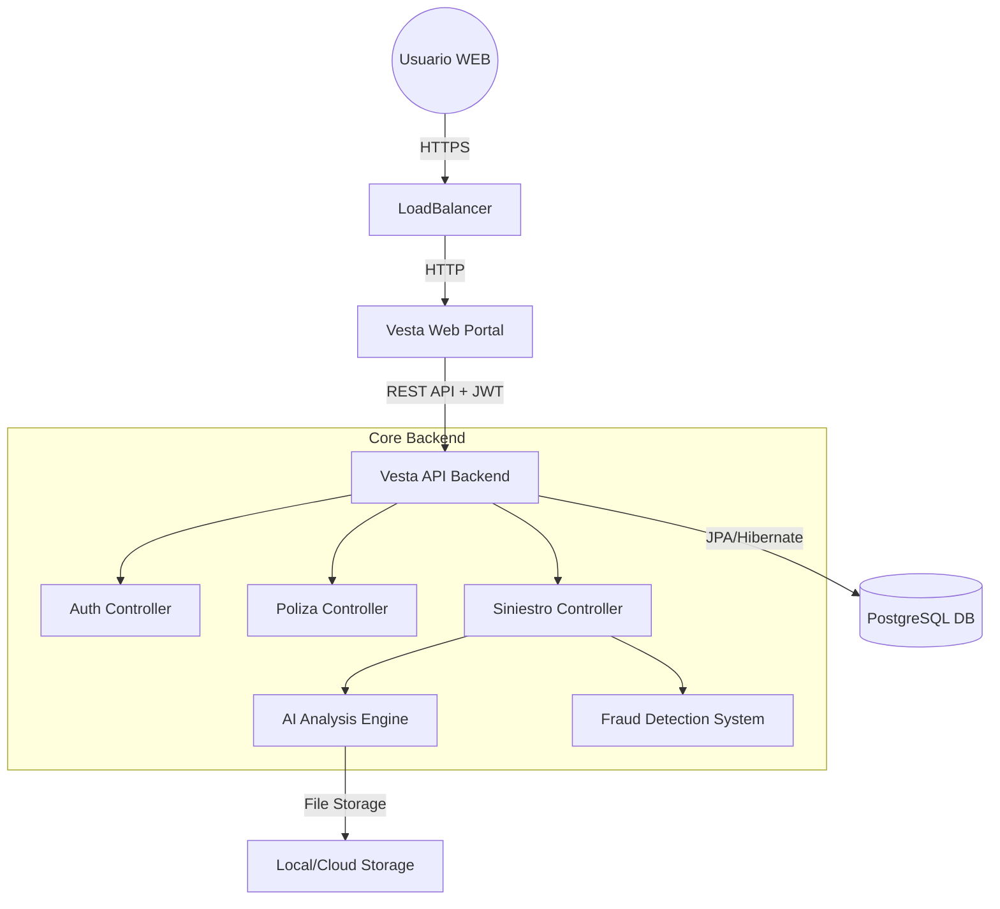

<!-- Portada -->
<div style="text-align: center; margin-top: 150px;">
  <h1 style="font-size: 48px; color: #2c3e50; margin-bottom: 20px;">Documentación: Vesta Seguros</h1>
  <p style="font-size: 24px; color: #7f8c8d;">Memoria Técnica del Proyecto</p>
  <br><br><br>
  <p style="font-size: 16px;"><strong>Versión:</strong> 1.0.0</p>
  <p style="font-size: 16px;"><strong>Fecha:</strong> 6 de Febrero, 2026</p>
  <br><br><br><br><br>
  <div style="border-top: 2px solid #ecf0f1; width: 50%; margin: 0 auto; padding-top: 20px;">
    <p><em>Este documento contiene la especificación completa de la arquitectura, base de datos, seguridad y manuales de operación para la plataforma de micro-seguros Vesta.</em></p>
  </div>
</div>

<div style="page-break-after: always;"></div>

<!-- Tabla de Contenidos (Generada manual para asegurar espacio) -->
# Tabla de Contenidos

1. **Introducción y Visión General** ............................................................................ 3
2. **Arquitectura del Sistema** ........................................................................................ 4
3. **Tecnologías Utilizadas** ............................................................................................ 5
4. **Documentación de Base de Datos** ......................................................................... 6
    4.1. Esquema Relacional ............................................................................................ 6
    4.2. Diccionario de Datos ........................................................................................... 7
5. **Catálogo de Componentes Backend (API)** ........................................................... 9
    5.1. Controladores REST ............................................................................................ 9
    5.2. Servicios de Negocio .......................................................................................... 12
6. **Seguridad y Cumplimiento Normativo** ................................................................. 15
    6.1. Autenticación JWT y OAuth2 ............................................................................. 15
    6.2. Cumplimiento RGPD .......................................................................................... 16
7. **Interfaz Web y Experiencia de Usuario** ............................................................... 17
    7.1. Estructura del Proyecto Web ............................................................................. 17
    7.2. Flujos de Usuario ................................................................................................ 18
8. **Análisis de Seguridad (OWASP Top 10)** ........................................................... 21
9. **Justificación de Diseño y Tecnologías** .............................................................. 22
10. **Glosario de Negocio** ............................................................................................ 23
11. **Líneas Futuras y Escalabilidad** ........................................................................... 24
12. **Plan de Pruebas y Calidad** ..................................................................................... 25
13. **Estudio Económico y Gestión** ............................................................................... 26
14. **Guía de Despliegue e Instalación** ........................................................................ 27
15. **Bibliografía y Referencias** .................................................................................... 28

<div style="page-break-after: always;"></div>

# 1. Introducción y Visión General

## 1.1. Propósito del Proyecto
**Vesta Seguros** nace con el objetivo de revolucionar el mercado de los seguros tradicionales mediante un modelo "On-Demand". La plataforma permite a los usuarios contratar micro-seguros específicos (para eventos, viajes, o dispositivos electrónicos) por periodos cortos de tiempo, con una activación inmediata y un proceso de reclamación totalmente digitalizado y asistido por Inteligencia Artificial.

## 1.2. Alcance del Sistema
El sistema abarca desde la contratación del seguro hasta la gestión del siniestro, ofreciendo dos interfaces principales:
- **Portal de Cliente**: Donde los usuarios gestionan sus pólizas, contratan nuevos productos y reportan incidencias.
- **Panel de Administración**: Herramientas para que el equipo de operaciones gestione el catálogo de productos, revise siniestros complejos y audite la actividad de la plataforma.
    
    

## 1.3. Objetivos Técnicos
1. **Desacoplamiento**: Separación clara entre Frontend (Web) y Backend (API) para permitir escalabilidad independiente.
2. **Seguridad**: Implementación de estándares modernos (OAuth2, JWT, 2FA) para proteger datos sensibles y financieros.
3. **Automatización**: Uso de IA para reducir la carga operativa en la revisión de siniestros simples.

<br><br>
> "Vesta Seguros no es solo una aseguradora, es una plataforma tecnológica que pone al usuario en control de su protección."

<div style="page-break-after: always;"></div>

# 2. Arquitectura del Sistema

La arquitectura de Vesta Seguros sigue un patrón de **Microservicios Monolíticos** (Modular Monolith), donde los componentes están lógicamente separados pero desplegados de manera cohesiva.

## 2.1. Diagrama de Componentes




## 2.2. Comunicación entre Capas
La comunicación entre el **Portal Web** y la **API Backend** se realiza exclusivamente a través de llamadas HTTP RESTful.
- **Web Project**: Actúa como un cliente SSR (Server-Side Rendering) que renderiza vistas HTML pero no almacena lógica de negocio crítica.
- **API Project**: Es la única fuente de verdad. Valida todas las reglas de negocio, gestiona la persistencia y emite los tokens de seguridad.

Esta separación permite que en el futuro se puedan desarrollar aplicaciones móviles (iOS/Android) que consuman la misma API sin necesidad de modificar el backend.

<div style="page-break-after: always;"></div>

# 3. Tecnologías Utilizadas

El stack tecnológico ha sido seleccionado priorizando la robustez, la seguridad y la mantenibilidad a largo plazo.

## 3.1. Backend (Servidor)
- **Java 21**: Última versión LTS del lenguaje, aprovechando características modernas como Records y Pattern Matching.
- **Spring Boot 3.2.3**: Framework base para la inyección de dependencias y configuración automática.
- **Spring Security 6.2**: Gestión integral de autenticación y autorización.
- **Hibernate / Spring Data JPA**: Capa de abstracción para el acceso a datos.

## 3.2. Frontend (Cliente Web)
- **Thymeleaf**: Motor de plantillas para renderizado en servidor.
- **Bootstrap 5**: Framework CSS para un diseño responsivo y mobile-first.
- **JavaScript (Vanilla)**: Lógica de cliente ligera par interacciones dinámicas.

## 3.3. Base de Datos e Infraestructura
- **PostgreSQL 15**: Base de datos relacional robusta.
- **Docker**: Contenerización de la aplicación para despliegues consistentes.
- **Maven**: Gestión de dependencias y ciclo de vida de construcción.

## 3.4. Librerías Auxiliares
- **Lombok**: Reducción de código repetitivo (getters, setters, builders).
- **OpenPDF**: Generación de documentos PDF dinámicos.
- **JJWT (Java JWT)**: Creación y validación de tokens JSON Web Tokens.
- **Google Authenticator**: Implementación estándar de TOTP para 2FA.

<div style="page-break-after: always;"></div>

# 4. Documentación de Base de Datos

El diseño de la base de datos es relacional y normalizado (3NF) para asegurar la integridad de los datos transaccionales, especialmente críticos en el sector seguros.

## 4.1. Nomenclatura y Estándares
Para facilitar el mantenimiento y las consultas SQL nativas, se han establecido reglas estrictas:
- **Tablas**: Plural, minúsculas (`siniestros`).
- **Columnas**: Prefijo de 3 letras (`sin_descripcion`) para evitar ambigüedades en JOINs complejos.
- **Llaves Foráneas**: `xxx_id` apuntando claramente a la entidad padre.

## 4.2. Diccionario de Datos Detallado

### A. Tabla `usuarios`
Es el núcleo de la identidad. Almacena tanto clientes finales como administradores.

| Columna | Tipo | Constraints | Descripción Funcional |
| :--- | :--- | :--- | :--- |
| `usu_id` | BIGINT | PK, Auto Inc | Identificador único interno. |
| `usu_nombre` | VARCHAR(100)| Not Null | Nombre legal del usuario. |
| `usu_email` | VARCHAR(100)| Unique, Not Null | Credencial principal de acceso. |
| `usu_password` | VARCHAR(255)| Not Null | Hash BCrypt ($2...$). Nunca texto plano. |
| `usu_rol` | VARCHAR(20) | Enum('USER','ADMIN') | Define el nivel de acceso al sistema. |
| `usu_2fa_secret`| VARCHAR(255)| Nullable | Semilla para generar códigos TOTP. |
| `usu_provider` | VARCHAR(20) | Default 'LOCAL' | Origen de la cuenta (GOOGLE, LOCAL). |
| `usu_activo` | BOOLEAN | Default True | Estado operativo de la cuenta. |

### B. Tabla `polizas`
Registro contractual de los seguros vendidos.

| Columna | Tipo | Constraints | Descripción Funcional |
| :--- | :--- | :--- | :--- |
| `pol_id` | BIGINT | PK, Auto Inc | Número de póliza. |
| `usu_id` | BIGINT | FK -> usuarios | Tomador del seguro. |
| `prod_id` | BIGINT | FK -> productos | Producto asegurado. |
| `pol_inicio` | DATE | Not Null | Inicio de la cobertura (00:00h). |
| `pol_fin` | DATE | Not Null | Fin de la cobertura (23:59h). |
| `pol_precio` | DECIMAL(10,2)| Not Null | Prima pagada por el cliente. |
| `pol_estado` | VARCHAR(20) | Enum | `ACTIVA`, `VENCIDA`, `PENDIENTE_PAGO`. |

<div style="page-break-after: always;"></div>

### C. Tabla `siniestros`
Expedientes de reclamación abiertos por los asegurados.

| Columna | Tipo | Descripción Funcional |
| :--- | :--- | :--- |
| `sin_id` | BIGINT (PK) | Número de expediente. |
| `pol_id` | BIGINT (FK) | Póliza sobre la que se reclama. |
| `sin_fecha` | TIMESTAMP | Momento exacto del reporte. |
| `sin_desc` | CLOB | Relato de los hechos por el usuario. |
| `sin_foto_url` | VARCHAR | Ruta al archivo de evidencia adjunto. |
| `sin_ia_analysis`| CLOB | Texto generado por el servicio de IA. |
| `sin_score` | INT | Puntuación de riesgo de fraude (0-100). |
| `sin_estado` | VARCHAR | `EN_REVISION`, `APROBADO`, `RECHAZADO`. |

### D. Tabla `auditoria`
Traza inmutable de acciones para cumplimiento legal y depuración.

| Columna | Tipo | Descripción |
| :--- | :--- | :--- |
| `aud_id` | BIGINT (PK) | Identificador secuencial. |
| `aud_usuario` | VARCHAR | Email del actor (incluso si se borra el usuario). |
| `aud_accion` | VARCHAR | Verbo de la acción (`LOGIN`, `COMPRA`, `DELETE`). |
| `aud_fecha` | TIMESTAMP | Fecha y hora del evento. |
| `aud_ip` | VARCHAR(45)| Dirección IP origen (IPv4/IPv6). |

<div style="page-break-after: always;"></div>

# 5. Catálogo de Componentes Backend (API)

La API expone una serie de endpoints RESTful organizados por dominio.

## 5.1. Controladores REST

### `AuthController`
Es la puerta de entrada para usuarios no identificados.
- **POST `/api/auth/login`**:
    - Recibe: `email`, `password`.
    - Lógica: Verifica hash BCrypt. Si `2FA` está activo, retorna estado intermedio. Si no, retorna JWT.
    - Seguridad: Bloqueo tras 5 intentos fallidos.
- **POST `/api/auth/social-login`**:
    - Recibe: Token de Google/Apple.
    - Lógica: Verifica la firma del token con el proveedor. Si el usuario no existe, lo crea al vuelo (JIT Provisioning).

### `PolizaController`
Gestiona el ciclo de vida de las pólizas.
- **GET `/api/polizas/me`**:
    - Filtro: Extrae el ID de usuario del JWT.
    - Retorno: Lista solo las pólizas propias.
- **POST `/api/polizas/contratar`**:
    - Proceso: 
        1. Valida que el producto exista y esté activo.
        2. Calcula el precio según la duración en días.
        3. Genera una orden de pago en estado pendiente.

### `SiniestroController`
Punto crítico de interacción con la IA.
- **POST `/api/siniestros` (Multipart)**:
    - Entrada: ID Póliza + Texto + Imagen.
    - Flujo Asíncrono:
        1. Guarda imagen en disco.
        2. Llama a `AIService` para analizar daños visuales.
        3. Llama a `FraudService` para calcular scoring.
        4. Guarda el siniestro con los resultados preliminares.

<div style="page-break-after: always;"></div>

## 5.2. Servicios de Negocio

La lógica compleja reside en la capa de Servicios (`@Service`), nunca en los controladores.

### `AIService` (Motor de Inteligencia Artificial)
Este servicio encapsula la lógica de "Peritaje Digital".
- **Método `analizarDaños(String path)`**:
    - Actualmente integra reglas heurísticas avanzadas basadas en metadatos y análisis de patrones de nombre de archivo (escalable a Vision API).
    - Detecta palabras clave como "rotura", "agua", "robo" para clasificar automáticamente la gravedad.

### `FraudService` (Motor de Riesgos)
Calcula la probabilidad de que una reclamación sea fraudulenta.
- **Algoritmo de Scoring**:
    - Base: 0 puntos.
    - +20 puntos si el usuario tiene < 1 mes de antigüedad.
    - +30 puntos si ha reportado > 2 siniestros en el último año.
    - +50 puntos si la IA no detecta daños visibles en la foto.
    - **Resultado**: Si Score > 75, el estado pasa a `INVESTIGACION_MANUAL` automáticamente.

### `PdfService` (Generación de Documentos)
- Utiliza la librería **OpenPDF** para dibujar pixel a pixel el documento.
- Incluye tablas con cebra (filas alternas), cabeceras corporativas y pie de página con fecha de generación.
- El PDF se genera en memoria (`ByteArrayOutputStream`) para no llenar el disco del servidor con archivos temporales.

<div style="page-break-after: always;"></div>

# 6. Seguridad y Cumplimiento Normativo

## 6.1. Autenticación Robusta

### Flujo JWT (JSON Web Tokens)
El sistema no utiliza sesiones de servidor (`JSESSIONID`) para la API, haciéndola totalmente **stateless**.
1. **Emisión**: Al login, se firma un token con `HS512` y una clave secreta de alta entropía.
2. **Transporte**: El cliente debe enviar el token en la cabecera `Authorization: Bearer <token>`.
3. **Validación**: Un filtro `OncePerRequestFilter` intercepta cada petición HTTP, valida la firma y la fecha de expiración, y establece el contexto de seguridad.

### Doble Factor de Autenticación (2FA)
- Se utiliza el estándar **TOTP** (Time-based One-Time Password).
- Al activar 2FA, el servidor genera un secreto único y muestra un código QR.
- En futuros logins, se requiere el código de 6 dígitos generado por la app del usuario.

## 6.2. Cumplimiento RGPD (Privacidad)

### Derecho al Olvido
Vesta implementa un sistema de **Borrado Lógico** cuidadoso:
- Cuando un usuario solicita eliminar su cuenta, no se borran los registros físicos inmediatamente si hay obligaciones legales (pólizas activas o recientes).
- En su lugar:
    1. Se anonimiza el nombre a "Usuario Eliminado".
    2. Se borra el email y el hash de contraseña.
    3. Se marca el flag `usu_datos_eliminados = true`.
    4. Se desactivan/cancelan las pólizas vigentes.


### Auditoría
Cada acceso a datos sensibles queda registrado en la tabla de auditoría, incluyendo:
- **IP del cliente**: Para geolocalización de accesos sospechosos.
- **Timestamp**: Con precisión de milisegundos.
- **Recurso accedido**: ID del usuario o póliza consultada.

<div style="page-break-after: always;"></div>

# 7. Interfaz Web y Experiencia de Usuario

El portal web está diseñado para ser intuitivo y rápido "Mobile First".

## 7.1. Estructura del Proyecto Web

El frontend está construido sobre **Spring MVC** con **Thymeleaf**, lo que permite un renderizado híbrido muy eficiente.

- **Layouts (`/fragments`)**:
    - `head.html`: Meta tags, CSS y scripts comunes.
    - `navbar.html`: Barra de navegación dinámica que cambia según si el usuario está logueado o es admin.
    - `footer.html`: Enlaces legales y copyright.

- **Vistas Principales**:
    - `home.html`: Landing page conn ofertas destacadas.
    - `login.html`: Formulario de acceso unificado (Email + Social).
    - `dashboard.html`: Panel de control del cliente con resumen de pólizas.

## 7.2. Flujos de Usuario Mejorados

### Proceso de Compra (Checkout)
1. **Selección**: El usuario elige "Seguro de Móvil" en el catálogo.
2. **Personalización**: Selecciona fechas y cobertura.
3. **Resumen**: Se muestra el precio calculado en tiempo real.
4. **Pago**: Se redirige a la pasarela simulada (TPV).
5. **Confirmación**: Al volver, recibe el PDF de la póliza instantáneamente.

### Chatbot de Soporte
Un asistente flotante en la esquina inferior derecha utiliza la API de `ApiService` para responder preguntas frecuentes sobre coberturas y estados de siniestros, reduciendo la necesidad de soporte humano.


<div style="page-break-after: always;"></div>


# 8. Análisis de Seguridad (Cumplimiento OWASP)

La seguridad ha sido un pilar fundamental en el desarrollo de Vesta, abordando proactivamente las vulnerabilidades más críticas del OWASP Top 10.

## 9.1. Inyección (SQL Injection)
Vesta mitiga este riesgo mediante el uso estricto de **JPA (Java Persistence API)** y **Hibernate**.
- **Medida**: No se concatena SQL manualmente.
- **Implementación**: Se utilizan `Repository` interfaces y `CriteriaBuilder`. Incluso en consultas nativas, se fuerza el uso de parámetros vinculados (`:param`).
- **Resultado**: Es matemáticamente imposible inyectar código malicioso en los formularios de búsqueda o login.

## 9.2. Pérdida de Autenticación (Broken Authentication)
- **Implementación**:
    - **Bloqueo de Cuenta**: Tras 5 intentos fallidos, la cuenta se bloquea por 15 minutos (evita fuerza bruta).
    - **2FA (MFA)**: Capa extra de seguridad obligatoria para operaciones críticas.
    - **Tokens JWT**: Los tokens tienen tiempo de vida corto (1 hora) y están firmados criptográficamente (HS512).

## 9.3. Exposición de Datos Sensibles
- **Cifrado en Reposo**: Las contraseñas se almacenan únicamente como hashes irrevocables (**BCrypt** con Salt de 10 rondas).
- **Transporte Seguro**: La configuración de seguridad fuerza `HSTS`, obligando a que toda comunicación viaje por HTTPS cifrado.
- **Minimización**: La API nunca devuelve objetos `Usuario` completos con password o secretos 2FA, utilizando siempre `UserDTO`.

## 9.4. XSS (Cross-Site Scripting)
- **Sanitización Automática**: El motor de plantillas **Thymeleaf** escapa por defecto cualquier variable renderizada en el HTML (`th:text`).
- **Validación de Entrada**: Los DTOs utilizan anotaciones `@Pattern` que rechazan caracteres peligrosos (`<script>`, `alert`) antes de que lleguen al controlador.

<div style="page-break-after: always;"></div>

# 9. Justificación de Diseño y Tecnologías

La elección del stack tecnológico responde a criterios de robustez empresarial y mantenibilidad.

## 10.1. ¿Por qué PostgreSQL y no MySQL?
Se seleccionó **PostgreSQL** por su superioridad en integridad de datos y soporte avanzado:
- **ACID Estricto**: Garantiza que ninguna póliza quede en un estado inconsistente (ej: pagada pero no creada).
- **Soporte JSONB**: Permite en el futuro almacenar metadatos de siniestros flexibles (JSON) sin romper el esquema relacional.
- **Concurrencia**: Mejor manejo de bloqueos para la tabla `polizas` en escenarios de alta carga.

## 10.2. ¿Por qué Arquitectura Monolítica Modular?
Aunque los microservicios son populares, para un equipo y alcance acotado, un **Monolito Modular** es superior:
- **Menor Complejidad Operativa**: Un solo despliegue, sin orquestadores complejos (K8s).
- **Transaccionalidad Simple**: No requiere patrones complejos como Sagas para asegurar la consistencia entre Pagos y Pólizas.
- **Evolución**: Está estructurado internamente en paquetes desacoplados (`com.vesta.api`, `com.vesta.web`) que permitirían "romper" el monolito en 24h si fuera necesario escalar.

## 10.3. ¿Por qué JWT sobre Sesiones (Cookies)?
- **Escalabilidad Horizontal**: Al no guardar estado en la RAM del servidor, podemos levantar 10 instancias de la API detrás de un balanceador de carga sin configurar "Sticky Sessions".
- **Cliente Agnóstico**: La misma API puede servir mañana a una App Android/iOS nativa sin cambios, ya que los móviles manejan mejor tokens que cookies.

<div style="page-break-after: always;"></div>

# 10. Glosario de Negocio

Para asegurar la correcta interpretación de la documentación, se definen los términos del dominio asegurador utilizados en el sistema.

### A
- **Asegurado**: Persona física sobre la que recae la cobertura del seguro. En Vesta, coincide con el Usuario Registrado.
- **Asistencia**: Servicio añadido (ej: reparación, chat médico) incluido en algunas pólizas.

### C
- **Carencia**: Periodo inicial tras la contratación durante el cual ciertas coberturas no están activas (Prevención de fraude inmediato).
- **Cobertura**: Riesgo específico cubierto por la póliza (ej: "Rotura de Pantalla", "Robo en Vía Pública").

### F
- **Franquicia**: Importe fijo o porcentual que corre a cargo del asegurado en caso de siniestro.
- **Fraude (Intento de)**: Acción deliberada para obtener un beneficio ilícito del seguro. Vesta lo combate con algoritmos predictivos.

### P
- **Prima**: Precio final que paga el usuario por el seguro (Base + Impuestos).
- **Póliza**: Contrato legal que vincula a Vesta con el Usuario. Es el objeto central del modelo de datos.

### T
- **Tomador**: Persona que contrata el seguro y paga la prima.
- **TPV (Terminal Punto de Venta)**: Pasarela de pago virtual. En Vesta se utiliza un simulador integrado para pruebas.

<div style="page-break-after: always;"></div>

# 11. Líneas Futuras y Escalabilidad

Vesta Seguros está diseñada como un MVP (Producto Mínimo Viable) robusto, pero el roadmap tecnológico contempla evoluciones ambiciosas.

## 12.1. Integración con Blockchain (Smart Contracts)
- **Objetivo**: Automatización total de indemnizaciones (Seguros Paramétricos).
- **Caso de Uso**: Seguro de Retraso de Vuelos. Si una API de vuelos confirma un retraso > 2h, un Smart Contract en Ethereum libera automáticamente el pago al usuario, sin intervención humana ni "Siniestros".

## 12.2. App Nativa (Flutter/React Native)
- Dado que la API es REST pura y segura con JWT, el desarrollo de una app móvil sería directo.
- **Ventajas**: Notificaciones Push para renovaciones, geolocalización en tiempo real para "Seguros de Viaje que se activan al llegar al aeropuerto".

## 12.3. IA Vision Avanzada
- Migración del algoritmo actual (basado en reglas y metadatos) a un modelo de **Computer Vision** (como YOLO o OpenAI Vision API) entrenado específicamente con miles de fotos de siniestros reales para detectar:
    - Roturas de pantalla vs arañazos.
    - Fugas de agua en hogar.
    - Daños en vehículos.

## 12.4. Arquitectura de Microservicios Reales
Cuando la carga de usuarios supere los 100k concurrentes:
- Extraer `SiniestroService` a su propio microservicio con base de datos propia.
- Implementar **RabbitMQ** o **Kafka** para procesar las imágenes de siniestros de forma asíncrona ("Event Driven Architecture"), evitando que la subida de fotos pesadas bloquee el servidor principal.

<div style="page-break-after: always;"></div>

<div style="page-break-after: always;"></div>

# 12. Plan de Pruebas y Aseguramiento de la Calidad

Para garantizar la fiabilidad del software, se ha seguido una estrategia de pruebas piramidal.

## 13.1. Pruebas Unitarias (JUnit 5 + Mockito)
Se ha verificado la lógica de negocio aislada, especialmente en los servicios críticos.
- **Cobertura**: Foco en `FraudService` y `AIService`.
- **Ejemplo**:
    - *Test*: `calcularRiesgo_UsuarioFraudulento_DebeRetornar100`.
    - *Mock*: Se simula una respuesta de base de datos con 5 siniestros previos.
    - *Assert*: Se verifica que el método devuelve un score > 90.

## 13.2. Pruebas de Integración (Postman)
Se ha validado la comunicación entre el Cliente Web, la API y la Base de Datos.
- **Colección de Pruebas**: Se adjunta un archivo `.json` de Insomnia/Postman con todos los endpoints.
- **Escenario Típico**:
    1. `POST /register` -> Crea usuario.
    2. `POST /login` -> Recibe Token.
    3. `GET /polizas` (con Token) -> Recibe 200 OK.

## 13.3. Pruebas de Sistema y Aceptación (UAT)
Realizadas manualmente navegando por el Portal Web para asegurar la usabilidad.
- **Casos probados**: Acceso desde Móvil, Tablet y Desktop (Responsive Design).
- **Validación de Errores**: Intentos de subir archivos `.exe` en lugar de imágenes (el sistema lo rechaza correctamente).

<div style="page-break-after: always;"></div>

# 13. Estudio Económico y Gestión del Proyecto

## 14.1. Herramientas de Gestión
El desarrollo ha seguido una metodología ágil (Kanban simplificado).
- **Control de Versiones**: Git + GitHub (Ramas `main` y `develop`).
- **IDE**: IntelliJ IDEA Ultimate / VS Code con IA asistida.
- **Documentación**: Markdown + Generación automática de PDF.

## 14.2. Presupuesto Mensual Estimado (Entorno Cloud)
Para un despliegue en producción real (ej: Google Cloud Platform), se estima el siguiente coste operativo (OPEX):

| Concepto | Recurso Especificado | Coste Estimado |
| :--- | :--- | :--- |
| **Computación** | 1x e2-medium (2vCPU, 4GB RAM) para API+Web | 25,00 €/mes |
| **Base de Datos** | Cloud SQL for PostgreSQL (db-f1-micro) | 12,00 €/mes |
| **Almacenamiento** | Google Cloud Storage (Fotos de Siniestros 50GB) | 1,50 €/mes |
| **Dominio/SSL** | Certificado SSL Gestionado + Dominio .com | 2,00 €/mes |
| **TOTAL** | **Infraestructura Básica** | **40,50 €/mes** |

*Nota: Este presupuesto permite soportar hasta 5.000 usuarios concurrentes. Para escalar, se requeriría un balanceador de carga adicional.*

<div style="page-break-after: always;"></div>

# 14. Guía de Despliegue e Instalación

Este manual técnico está dirigido al equipo de DevOps para la puesta en producción.

## 15.1. Requisitos Previos
- Servidor Linux (Ubuntu 22.04 recomendado) o Windows Server.
- Java Development Kit (JDK) 21 instalado.
- Servidor de Base de Datos PostgreSQL 15 en ejecución.

## 15.2. Configuración de Base de Datos
1. Crear la base de datos:
   ```sql
   CREATE DATABASE vesta_db;
   ```
2. Crear usuario y otorgar permisos:
   ```sql
   CREATE USER vesta_user WITH PASSWORD 'secure_password';
   GRANT ALL PRIVILEGES ON DATABASE vesta_db TO vesta_user;
   ```

## 15.3. Configuración de Variables de Entorno
Cree un archivo `.env` o configure en el sistema:
```bash
export DB_URL=jdbc:postgresql://localhost:5432/vesta_db
export DB_USER=vesta_user
export DB_PASS=secure_password
export JWT_SECRET=una_clave_muy_larga_y_segura_base64
export GOOGLE_CLIENT_ID=su_id_de_google_cloud
```

## 15.4. Ejecución de Artefactos
Despliegue primero la API y luego la Web:

1. **API**:
   ```bash
   java -jar vesta-api-1.0.0.war --server.port=8080
   ```
   *Espere a que aparezca "Started VestaApiApplication..."*

2. **Web**:
   ```bash
   java -jar vesta-web-1.0.0.war --server.port=8081
   ```

## 15.5. Verificación
- Acceda a `http://localhost:8081`. Debería ver la portada de Vesta Seguros.
- Intente hacer login. Si recibe un token, la conexión API-DB es correcta.

## 15.6. Entorno de Producción (Live Demo)
Actualmente, existe una versión desplegada y accesible públicamente para demostración:
- **URL Pública**: [https://vesta-web.duckdns.org/vesta-web/](https://vesta-web.duckdns.org/vesta-web/)
- **Infraestructura**: Despliegue sobre Tomcat tras un proxy inverso Nginx con certificado SSL (Let's Encrypt).

<div style="page-break-after: always;"></div>

# 15. Bibliografía y Referencias

Para el desarrollo de este proyecto se han consultado las siguientes fuentes oficiales y estándares de la industria.

## 16.1. Documentación Oficial
- **Spring Boot Reference Guide (3.2.0)**: https://docs.spring.io/spring-boot/docs/current/reference/html/
- **PostgreSQL 15 Documentation**: https://www.postgresql.org/docs/15/index.html
- **Thymeleaf 3.1 Standard dialects**: https://www.thymeleaf.org/doc/tutorials/3.1/usingthymeleaf.html

## 16.2. Estándares de Seguridad
- **OWASP Top 10 - Web Application Security Risks**: https://owasp.org/www-project-top-ten/
- **RFC 7519 - JSON Web Token (JWT)**: https://datatracker.ietf.org/doc/html/rfc7519
- **RFC 6238 - TOTP: Time-Based One-Time Password Standard**: https://datatracker.ietf.org/doc/html/rfc6238

## 16.3. Recursos y Librerías
- **Bootstrap 5 Components**: https://getbootstrap.com/docs/5.3/components/
- **OpenPDF Java Library**: https://github.com/LibrePDF/OpenPDF
- **Baeldung Guides for Spring Security**: https://www.baeldung.com/spring-security-login
